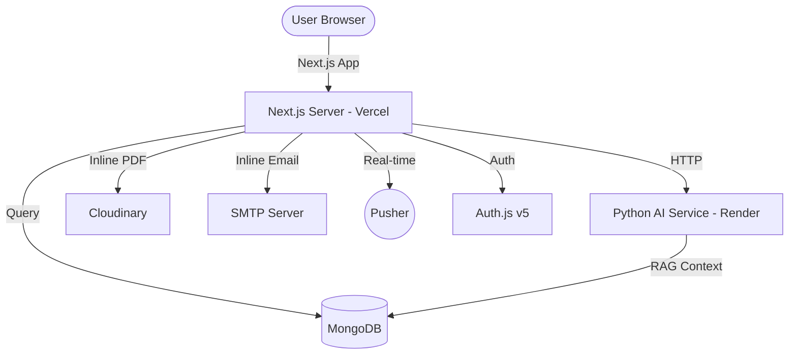

# Gurukul Classes Platform

A production-grade, enterprise-scale educational management system and AI-powered learning hub designed for Gurukul Classes, Ahmedabad. This ecosystem combines a high-performance Next.js frontend with a specialized Python AI microservice.

---

## Technical Stack

[](https://nextjs.org/)
[](https://www.typescriptlang.org/)
[](https://fastapi.tiangolo.com/)
[](https://www.mongodb.com/)
[](https://pusher.com/)
[](https://tailwindcss.com/)
[](https://www.framer.com/motion/)
[](https://cloudinary.com/)

---

## System Architecture

The platform follows a clean two-service architecture: a Next.js frontend hosted on Vercel and a Python AI microservice on Render.



---

## Ecosystem Modules

### 1. Student Portal (Public Ecosystem)
- **Academic Mentor**: Llama-3.3-70B powered tutor with deep knowledge of Gujarat Board (GSEB), NCERT, JEE, and NEET.
- **Course Catalog**: Comprehensive overview of Foundation, Board, and Competitive exam coaching.
- **Topper Gallery**: Performance tracking and public recognition for top-performing students.
- **Faculty and Events**: Dynamic directory of educators and real-time institute event calendars.
- **Admissions Pipeline**: Structured inquiry forms and career/faculty application portals.

### 2. Admin and Staff Control Center
- **Institutional Management**: Control over Faculty, Events, Toppers, and public Announcements.
- **Attendance and Schedules**: Centralized tracking of student attendance and dynamic classroom scheduling.
- **Content Architect**: AI-powered tool for generating branded, illustrated study modules (PDF) with inline processing (`maxDuration=60`).
- **Push Notification Engine**: Real-time admin alerts and system notifications via Pusher.
- **Staff Ecosystem**: Specialized dashboard for teaching staff to manage student data and classroom operations.

### 3. AI Learning Hub (`/ai-service`)
A dedicated Python/FastAPI microservice handling all intelligent computations.
- **RAG Engine**: Fetches live MongoDB context to ensure AI answers are grounded in Gurukul facts.
- **Note Architect**: Expert pedagogical generation with descriptive image prompts for complex topics.
- **Elite Personas**: PhD-level academic guidance optimized for STEM subjects.

---

## Infrastructure Core

### 1. Inline AI Processing (Vercel `maxDuration=60`)
All AI-intensive tasks run inline within the API route, leveraging Vercel's extended timeout:
- **PDF Generation**: Auto-creates branded PDFs with embedded AI diagrams via jsPDF.
- **Cloudinary Upload**: Stores generated PDFs for permanent access.
- **Email Delivery**: Inline SMTP dispatch for inquiry notifications and confirmations.

### 2. Observability (Winston)
Comprehensive logging layer for system health:
- **Request Tracing**: Middleware-level tracking of all incoming traffic.
- **Combined Logs**: Centralized JSON-structured log files for production monitoring.

### 3. Security Hardening
- **IP Rate Limiting**: Multi-tier throttling for public APIs and admin actions.
- **Auth.js v5 Integration**: Secure Google OAuth and Credentials-based authentication.
- **Security Middleware**: Strict Content Security Policy (CSP), HSTS, and XSS protection.

---

## Data Models (MongoDB)

| Model | Purpose |
| :--- | :--- |
| **Student** | Core student records, performance, and contact info. |
| **Faculty** | Educator profiles, expertise, and roles. |
| **Topper** | Historical exam result data and achiever records. |
| **Event** | Institute holidays, exams, and event schedules. |
| **Note** | AI-generated study modules and PDF links. |
| **Inquiry** | Public admission and contact requests. |
| **Schedule** | Classroom timings and subject allocations. |
| **Attendance** | Daily student and staff activity tracking. |

---

## Directory Map

```text
├── ai-service/              # Python AI Microservice (Expert Brain)
├── src/
│   ├── app/                 # Next.js App Router (Routes and APIs)
│   ├── components/          # UI Components (Radix + Framer Motion)
│   ├── lib/
│   │   ├── db/              # Mongoose Models and Schemas
│   │   ├── services/        # AI, Email, and Cloudinary logic
│   │   ├── logger.ts        # Winston Logging Engine
│   │   └── rate-limiter.ts  # Advanced Throttling Logic
│   └── middleware.ts        # Security and Traffic Traces
└── logs/                    # Production JSON Log Storage
```

---

## Setup and Deployment

### Environment Configuration
The platform requires a `.env.local` containing:
- `MONGODB_URI`, `GROQ_API_KEY`, `PYTHON_AI_URL`, `CLOUDINARY_CLOUD_NAME`, `CLOUDINARY_API_KEY`, `CLOUDINARY_API_SECRET`, `PUSHER_APP_ID`.

### Deployment Architecture
1. **Frontend (Vercel)**: `npm run build` -- automatic via Git push.
2. **AI Service (Render)**: `uvicorn main:app --host 0.0.0.0 --port 8000`

### Local Development
1. **Frontend**: `npm run dev`
2. **AI Service**: `cd ai-service && uvicorn main:app --port 8000`

---

Proprietary Software of Gurukul Classes, Ahmedabad.
Established 2011.